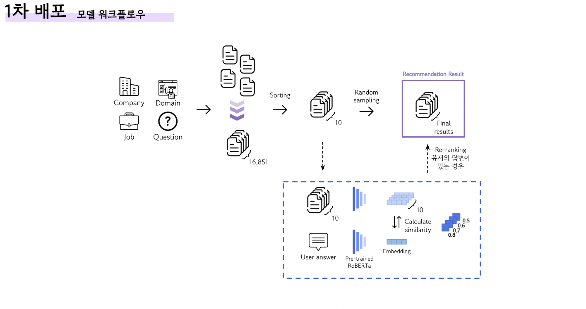
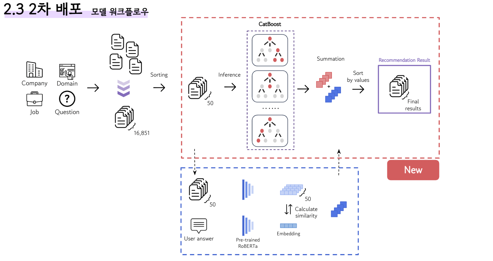

# RecommendU-ML
   

## Overview
RecommendU 서비스에서 추천시스템 모델링 과정은 크게 두 개로 나뉩니다.
1. 유저-자기소개서 문항간 상호작용 데이터 수집을 위한 Content-based Filtering 모델링 과정
2. 개인화된 추천 결과를 제공할 Model-based Collaborative Filtering 모델링 과정

이 중 두 번의 모델링을 진행하며 가장 신경썼던 부분은 추천을 제공하는 과정에 대한 **사용자의 맥락과 latency**입니다. 이를 반영하기 위해서는 **추론해야할 자기소개서 문항을 줄이는 Retrieval** 과정이 필수였습니다.

**결과값을 내야할 아이템 수를 줄이는 Retrieval** 과정은 각 배포 단계 모두 동일한 원리를 사용했으며, **아이템 간의 순위를 정해주는 Ranking** 과정에서의 차이가 1차 배포에 대한 모델과 2차 배포에 대한 모델에서 나뉘게 됩니다.

## Model workflow
### 공통

**Retrieval**: 유저의 **관심 회사, 관심 분야, 관심 직무, 질문에** 따라 서로 다르게 적용된 가중치를 따라서 정렬 후, Top **N**개로 추려냅니다.

### 1차 배포 모델링 과정

  
<b>Model workflow</b> Content-based Filtering

**Ranking**

- 답변이 없는 경우: 1차 배포는 유저들이 다양한 자기소개서 문항과의 상호작용을 쌓은 데이터를 활용하고자 했기 때문에, 추려진 자기소개서 문항을 **random sampling**하여 유저에게 추천합니다.
- 답변이 있는 경우: 답변이 존재할 때, 답변과 유사한 자기소개서를 추천해주는 것이 우선이었기에, 답변과 추려진 문항들 간의 **코사인 유사도**를 계산합니다. 이후 코사인 유사도 순으로 정렬하여 유저에게 추천합니다.

### 2차 배포 모델링 과정

  
<b>Model workflow</b> Model-based Collarboratve Filtering

**Ranking**

- 답변이 없는 경우: 유저와 자기소개서 문항간 관계를 학습한 GBDT 계열의 **CatBoost**를 활용한다. 답변이 존재하지 않을 경우, 추려진 자기소개서 문항을 확률값으로 순위를 매겨 순서를 정한 후 유저에게 추천합니다.
- 답변이 있는 경우: 계산된 **코사인 유사도**와 **CatBoost**의 확률값을 더하여 순위를 매겨 유저에게 추천합니다.

